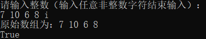
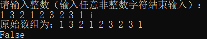

# 编程题

## 题目简介

给定一个整数数组，玩家1和玩家2轮流从数组中取数字。两个玩家开始得分都是0，每一回合，玩家从数组的一端(头或尾)取出一个数字加入自己得分中，取出的数字将从数组中移除，当数组为空时游戏结束。假设玩家1为先手，设计一个函数，若玩家1能够必胜(即游戏过程中无论玩家2选头还是尾都必输)，则返回true，否则返回false。玩家1与玩家2同分认定为玩家1获胜。通过递归方式求解。

## 解题思路

### 具体思路

为了判断哪个玩家可以获胜，需要计算一个总分，即先手得分与后手得分之差。当数组中的所有数字都被拿取时，如果总分大于或等于 0，则先手获胜，反之则后手获胜。

在游戏规则中，数组中的数字只能从任意一端取出，因此剩余数字必定构成数组中的连续子数组，可以使用开始下标和结束下标来表示。

用 `[start, end]` 表示子数组的下标范围。当 `start=end` 时，子数组中只有一个数字，此时当前玩家只能取该数字；而当 `start < end` 时，当前玩家可以取下标 start 或 end 处的数字，而另一位玩家则在下标范围 `[start + 1, end]` 或 `[start, end − 1]` 中继续取数。这是一个递归的过程。

在采取最优策略时，玩家应该使自己的得分与对手的得分之差最大化。用 `total(nums,start, end)` 表示子数组的下标范围为 `[start, end]` 时，当前玩家与对方玩家的得分之差的最大值。

对于情况 `start=end`，即子数组中只有一个数字，当前玩家只能取`nums[start]`，因此`total(nums,start,end)=nums[start]`。

对于情况 start<end，当前玩家可以取 `nums[start]` 或 `nums[end]`，对应分数分别为 `scoreStart=nums[start] * turn + total(nums, start + 1, end)` 和 `scoreEnd=nums[end] * turn + total(nums, start, end − 1)`。

对两种方案分别计算当前玩家可以得到的分数，其中的最大值为当前玩家最多可以得到的分数。

### 题目标签

**递归** **最大最小值搜索** **数组** **博弈论**

## 解决方案源代码

~~~cpp
class Solution {
public:
	bool FirstWinner(std::vector<int>& nums) {
		return total(nums, 0, nums.size() - 1, 1) >= 0;
	}

	int total(std::vector<int>& nums, int start, int end, int turn) {
		if (start == end) {
			return nums[start] * turn;
		}
		int scoreStart = nums[start] * turn + total(nums, start + 1, end, -turn);
		int scoreEnd = nums[end] * turn + total(nums, start, end - 1, -turn);
		if (turn == 1) {
			return std::max(scoreStart, scoreEnd);
		}
		else
			return std::min(scoreStart, scoreEnd);
	}
};
~~~

## 测试用例
输入:[1,5,2]
输出:False

输入:[7,10,6,8]
输出:True

输入:[1,3,2,1,2,3,2,3,1]
输出:False
