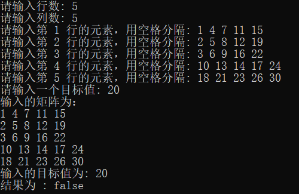
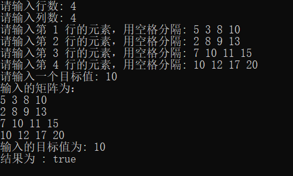

# 编程题

## 题目简介

编写一个算法实现搜索 `M × N` 矩阵 `matrix` 中的一个目标值 `target` 。该矩阵具有以下特性：
每行的元素从左到右升序排列。
每列的元素从上到下升序排列。
要求：时间复杂度小于$O(mn)$.

## 解题思路

### 具体思路

1. **初始化位置**：搜索开始于矩阵的左下角，坐标为 `(row - 1, 0)`，即 `i = row - 1` 和 `j = 0`。这是因为左下角的元素在其所在列中是最大的，而在其所在行中是最小的。

2. **移动规则** ：
**a.** 如果目标值 `target` 大于当前位置的元素 `matrix[i][j]`，这意味着目标值不可能出现在当前元素的这一行中（因为当前行的其他元素都比当前元素小）。因此，需要向右移动，即 `j++`，以查找更大的元素。**b.** 如果目标值 `target` 小于当前位置的元素 `matrix[i][j]`，这意味着目标值不可能出现在当前元素的这一列中（因为当前列的其他元素都比当前元素大）。因此，需要向上移动，即 `i--`，以查找更小的元素。**c.** 如果目标值 `target` 等于当前位置的元素，返回 `"true"` 表示找到了目标值。

3. **边界检查**：在每次移动后，都检查新的坐标 `(i, j)` 是否越界。如果列索引 `j` 超出矩阵的最大列数或者行索引 `i` 小于0，意味着目标值不在矩阵中，返回 `"false"`。

4. **循环终止条件**：循环直到找到目标值或者索引越界。循环条件是 `i >= 0 && j <= col - 1`

### 题目标签

**分治法** **二分查找** **数组**

## 解决方案源代码

~~~cpp
class Solution {
public:
	std::string searchMatrix(std::vector<std::vector<int>> matrix, int target) {
		int row = matrix.size();		// 行数
		int col = matrix[0].size();		// 列数
		int i = row - 1, j = 0;			// 左下角的元素
		while (i >= 0 && j <= col - 1) {
			if (target > matrix[i][j]) {
				j++;
				if (j > col - 1) return "false";
			}
			else if (target < matrix[i][j]) {
				i--;
				if (i < 0) return "false";
			}
			else return "true";
		}
		return "false";
	}
};
~~~

## 测试用例
输入:

矩阵：

	[ 1, 4, 7,11,15
	  2, 5, 8,12,19
	  3, 6, 9,16,22
	 10,13,14,17,24
	 18,21,23,26,30]
目标值：[5]

输出:true

输入:

矩阵：

	[ 1, 4, 7,11,15
	  2, 5, 8,12,19
	  3, 6, 9,16,22
	 10,13,14,17,24
	 18,21,23,26,30]
目标值：[20]

输出:false

输入:

矩阵：

	[ 5, 3, 8,10
	  2, 8, 9,13
	  7,10,11,15
	 10,12,17,20]
目标值：[10]

输出:true

