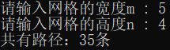

# 编程题

## 题目简介

⼀个机器⼈位于⼀个 `m x n` ⽹格的左上⻆，机器⼈每次只能向下或者向右移动⼀步。机器⼈试图达到⽹格的右下
⻆。问总共有多少条不同的路径？输⼊为⽹络的尺⼨m和n，输出为路径的数量，动态规划法求解。

## 解题思路

### 具体思路

我们用 $f(i,j)$ 表示从左上角走到 $(i,j)$  的路径数量，其中 $i$ 和 $j$ 的范围分别是 $[0,m)$ 和 $[0,n)$ 。

由于我们每一步只能从向下或者向右移动一步，因此要想走到 $(i, j)$，如果向下走一步，那么会从 $(i−1,j)$ 走过来；如果向右走一步，那么会从 $(i,j−1)$ 走过来。因此我们可以写出动态规划转移方程：

$f(i, j) = f(i-1, j) + f(i, j-1)$

需要注意的是，如果 $i=0$，那么 $f(i-1,j)$ 并不是一个满足要求的状态，我们需要忽略这一项；同理，如果 j=0j=0j=0，那么 f(i,j−1)f(i,j-1)f(i,j−1) 并不是一个满足要求的状态，我们需要忽略这一项。

初始条件为 $f(0,0)=1$，即从左上角走到左上角有一种方法。

最终的答案即为 $f(m-1,n-1)$。

### 题目标签

**动态规划**

## 解决方案源代码

~~~cpp
class Solution {
public:
    int uniquePaths(int m, int n) {

        std::vector<std::vector<int>> dp(m, std::vector<int>(n, 0));

        //初始化dp矩阵
        for (int i = 0; i < m; i++)//第一行的只有一种办法到达（一直向右走）
            dp[i][0] = 1;
        for (int j = 0; j < n; j++)//第一列的只有一种办法到达（一直向下走）
            dp[0][j] = 1;

        for (int i = 1; i < m; i++)//根据递推公式更新
            for (int j = 1; j < n; j++)
                dp[i][j] = dp[i - 1][j] + dp[i][j - 1];

        return dp[m - 1][n - 1];
    }
};
~~~

## 复杂度分析

时间复杂度：$O(mn)$。

空间复杂度：$O(mn)$，即为存储所有状态需要的空间。注意到 $f(i, j)$ 仅与第 iii 行和第 i−1i-1i−1 行的状态有关，因此我们可以使用滚动数组代替代码中的二维数组，使空间复杂度降低为 $O(n)$。此外，由于我们交换行列的值并不会对答案产生影响，因此我们总可以通过交换  $m$ 和 $n$ 使得 $m≤n$ ，这样空间复杂度降低至 $O(min(m, n))$

## 测试用例
输入: m=5, n=4

输出: 35条

输入:m=8, n=8

输出: 3432条

输入:m=4, n=9

输出: 165条

