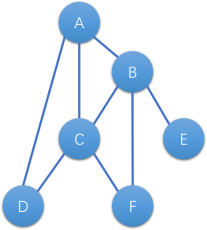
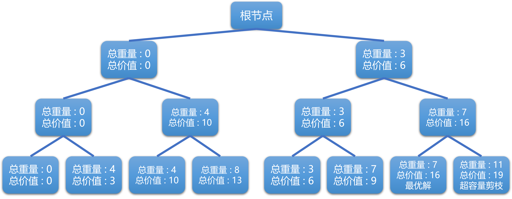
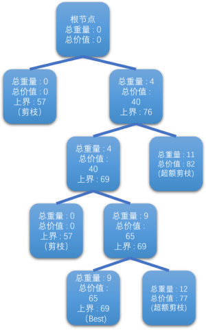

# 书面题

## 1.

#### 题意理解

我们需要安排6门课程的考试，这些课程分别是A, B, C, D, E和F。有四种类型的选课组合：DCA, BCF, EB, AB。我们需要在六天内安排这些考试，每天一个，而且不能有学生连续两天都有考试。

#### 建立约束条件

据学生的选课情况，我们知道：
1. 选修了DCA的学生，D、C、A三门课程的考试不能连续安排。
2. 选修了BCF的学生，B、C、F三门课程的考试不能连续安排。
3. 选修了EB的学生，E、B两门课程的考试不能连续安排。
4. 选修了AB的学生，A、B两门课程的考试不能连续安排。

#### 图着色

这个问题可以转换成图着色问题，其中每门课程是图中的一个节点，如果两门课程不能在连续两天进行，则它们之间有一条边。每天可以看作是一种颜色，我们需要给图中的每个节点着色，相邻的节点（即有边相连的节点）不能着相同的颜色。



邻接矩阵表示：

A: B, C, D

B: A, C, F, E

C: A, B, D, F

D: A, C

E: B

F: B, C

#### 解决方案

我们可以使用回溯法来为图中的每个节点分配颜色。对于每门课程（节点），我们尝试每种颜色（日期），然后检查是否与已经着色的相邻节点（即已安排考试的相关课程）冲突。如果没有冲突，我们将颜色分配给节点，并且递归地继续为下一个节点选择颜色。如果所有节点都不能分配颜色，则回溯到上一个节点，改变颜色，再尝试。这样，直到为所有节点分配颜色或者确定不存在解决方案。

用C++代码实现：
```cpp
class ExamScheduler {
private:
    static const int NUM_COURSES = 6;
    std::array<std::vector<int>, NUM_COURSES> constraints;
    std::vector<int> schedule;

    bool canSchedule(int course, int day) {
        for (int conflict : constraints[course]) {
            if (schedule[conflict] == day || abs(schedule[conflict] - day) == 1) {
                return false;
            }
        }
        return true;
    }

    bool scheduleCourse(int course) {
        if (course == NUM_COURSES) return true;

        for (int day = 1; day <= NUM_COURSES; ++day) {
            if (canSchedule(course, day)) {
                schedule[course] = day;
                if (scheduleCourse(course + 1)) {
                    return true;
                }
                schedule[course] = 0;
            }
        }
        return false;
    }

public:
    ExamScheduler() : schedule(NUM_COURSES, 0) {
        // Initialize the constraints for each course based on the students' choices
        constraints = {{
            /* A */ {2, 3}, // A conflicts with C and D
            /* B */ {2, 5}, // B conflicts with C and F
            /* C */ {0, 1, 3, 5}, // C conflicts with A, B, D, and F
            /* D */ {0, 2}, // D conflicts with A and C
            /* E */ {1}, // E conflicts with B
            /* F */ {1, 2} // F conflicts with B and C
        }};
    }

    bool findSchedule() return scheduleCourse(0);

    void printSchedule() {
        if (!findSchedule()) {
            std::cout << "No valid schedule found.\n";
            return;
        }

        for (int i = 0; i < NUM_COURSES; ++i)
            std::cout << "Course " << char('A' + i) << " on day " << schedule[i] << "\n";
    }
};
```

#### 最终结果

课程 A 安排在第 1 天考试

课程 B 安排在第 3 天考试

课程 C 安排在第 5 天考试

课程 D 安排在第 3 天考试

课程 E 安排在第 1 天考试

课程 F 安排在第 1 天考试

## 2.

#### 核心思想

解决0/1背包问题时，我们采用回溯法，其核心思想是试探并回退：对每个物品，我们都决策“放入背包”或“不放入背包”，然后根据这个决策继续向下试探，直到达到决策树的底部（即考虑完所有物品）。如果在任何时刻，我们放入物品导致背包超重，则停止继续试探这条路径，并回退到上一个决策点。

#### 解题步骤

1. 构建决策树：决策树是一个完全二叉树，每个节点代表一个决策状态。树的每一层对应一个物品，第一层是第一个物品，第二层是第二个物品，以此类推。每个节点有两个子节点：左子节点表示不放入当前层对应的物品，右子节点表示放入。
2. 回溯搜索：从树的根节点开始，对于每一个节点（表示一种放入或不放入的决策），我们检查：
· 如果继续这个决策，是否会导致背包总重量超过容量C。
· 如果不超重，我们记录当前的总价值，并继续向下搜索。
· 如果我们到达了一个叶子节点，这意味着我们已经考虑了所有的物品，此时，我们更新最优解和最大价值（如果当前解的价值高于之前记录的最优价值）。
3. 剪枝：在搜索过程中，如果某个节点的决策已经导致背包超重，我们停止搜索这条路径并回退，这称为“剪枝”。剪枝可以减少搜索空间，提高算法效率。
4. 记录解：在搜索过程中，我们需要记录当前的解和最优解。当前解是一个0-1向量，表示对每个物品的放入决策。最优解是我们在所有可能的解中找到的价值最大的解。
5. 输出结果：搜索完成后，我们得到最优解的0-1向量和最大价值。0-1向量中的每个元素对应一件物品，1表示物品被选中放入背包，0表示未被选中。

#### 解决方案

```cpp
// 物品结构
struct Item {
    int value;
    int weight;
};

// 0/1背包问题的回溯解法类
class KnapsackSolver {
private:
    std::vector<Item> items; // 物品集合
    int capacity; // 背包容量
    int max_value; // 目前为止的最大价值
    std::vector<int> best_solution; // 目前为止的最优解
    std::vector<int> current_solution; // 当前解

    // 回溯搜索函数
    void backtrack(int item_index, int current_weight, int current_value) {
        if (item_index == items.size()) { // 达到叶节点
            if (current_value > max_value) {
                max_value = current_value;
                best_solution = current_solution;
            }
            return;
        }

        // 不放入当前物品
        current_solution[item_index] = 0;
        backtrack(item_index + 1, current_weight, current_value);

        // 放入当前物品，如果不超过背包容量
        if (current_weight + items[item_index].weight <= capacity) {
            current_solution[item_index] = 1;
            backtrack(item_index + 1, current_weight + items[item_index].weight,
                      current_value + items[item_index].value);
        }
    }

public:
    KnapsackSolver(const std::vector<Item>& items, int capacity)
        : items(items), capacity(capacity), max_value(0) {
        current_solution.resize(items.size(), 0);
    }

    // 解问题
    void solve() {
        backtrack(0, 0, 0);
    }

    // 打印最优解
    void printSolution() {
        std::cout << "Max value: " << max_value << "\n";
        std::cout << "Best solution: [";
        for (int i = 0; i < best_solution.size(); ++i) {
            std::cout << best_solution[i] << (i < best_solution.size() - 1 ? ", " : "");
        }
        std::cout << "]\n";
    }
};
```

#### 决策树

如果定义**左子树为不放入，右子树为放入**，则有如下决策树 : 



则最终结果为：最优值：16 最优解：1，1，0.

## 3.

#### 解决思路

从节点1开始，探索所有可能的下一步路径。这些路径是1到其他各节点的路径。
计算每个节点的最低成本估计，这个估计通常是当前的路径成本加上从该节点到所有未访问节点的最低成本边的和，再加上所有这些未访问节点回到起始节点的最低成本边。
选择最低成本估计的节点作为下一步路径。
重复步骤1到3，直到访问了所有节点并返回到节点1。
在整个搜索过程中保持一个当前的最佳解，每当找到一个比当前最佳解更低成本的完整路径时，就更新这个最佳解。
当所有的节点都被探索并且没有更低的成本估计可以考虑时，当前的最佳解就是最优解。

#### 解决方案
```cpp
class TSPSolver {
private:
    int numVertices;
    std::vector<std::vector<int>> graph;
    std::vector<bool> visited;
    int bestWeight;
    std::vector<int> bestPath;

    void TSP(int node, int cost, std::vector<int>& path) {
        // Mark the node as visited
        visited[node] = true;
        path.push_back(node);

        // If all vertices are visited, then check if there is an edge from
        // last vertex in path back to the first vertex
        if (path.size() == numVertices) {
            if (graph[node][0]) { // check if we can go back to the starting node
                int tourCost = cost + graph[node][0];
                if (tourCost < bestWeight) {
                    bestWeight = tourCost;
                    bestPath = path;
                }
            }
        } else {
            // Try all vertices as a next candidate in Hamiltonian Circuit
            for (int i = 0; i < numVertices; i++) {
                if (!visited[i] && graph[node][i]) {
                    TSP(i, cost + graph[node][i], path);
                }
            }
        }

        // Mark the node as unvisited for other paths
        path.pop_back();
        visited[node] = false;
    }

public:
    TSPSolver(int vertices, const std::vector<std::vector<int>>& g)
        : numVertices(vertices), graph(g), visited(vertices, false), bestWeight(INT_MAX) {}

    void Solve() {
        std::vector<int> path;
        TSP(0, 0, path);
    }

    void PrintSolution() {
        std::cout << "Minimum weight Hamiltonian Cycle: " << bestWeight << std::endl;
        std::cout << "Path: ";
        for (int vertex : bestPath) {
            std::cout << vertex + 1 << " ";
        }
        std::cout << std::endl;
    }
};

int main() {
    // Create a graph
    std::vector<std::vector<int>> graph = {
        // Assuming '0' is no path and other values are weights of the edges
        {0, 3, 0, 0, 8},
        {3, 0, 5, 6, 0},
        {0, 5, 0, 4, 2},
        {0, 6, 4, 0, 3},
        {8, 0, 2, 3, 0}
    };

    TSPSolver solver(graph.size(), graph);
    solver.Solve();
    solver.PrintSolution();

    return 0;
}
```

#### 最终结果

最优成本：16

最优路径：1，3，5，4，2，1

## 4.

| 物品 | 重量 | 价值 | 单位价值 |
| --- | --- | --- | --- |
| 1   | 4   | 40  | 10  |
| 2   | 7   | 42  | 6   |
| 3   | 5   | 25  | 5   |
| 4   | 3   | 12  | 4   |

#### 解决思路

1. 初始化：
·从根节点开始，不包含任何物品，背包当前重量为0，当前价值为0。
2. 构建解空间树：
·在每个节点，我们都有两个选择：包含当前物品或不包含。
·每次选择都检查背包容量，如果超过10，则不再考虑该分支（因为物品不可拆分）。
3. 计算上界：
·对于当前节点，计算包含剩余物品（按单位重量价值排序）直至背包满或物品用尽的理论最大价值。这称为界限。
4. 裁剪：
·如果某个节点的界限低于已知的最大价值，则裁剪该分支。
5. 选择最优解：
·遍历完所有节点后，保留价值最高的路径作为最优解。

#### 代码实现
```cpp
class KnapsackSolver {
private:
    int numItems;
    int capacity;
    std::vector<int> weights;
    std::vector<int> values;

public:
    KnapsackSolver(int num, int cap, std::vector<int>& w, std::vector<int>& v)
        : numItems(num), capacity(cap), weights(w), values(v) {}

    int solve() {
        std::vector<std::vector<int>> dp(numItems + 1, std::vector<int>(capacity + 1, 0));

        // Build table dp[][] in bottom up manner
        for (int i = 1; i <= numItems; i++) {
            for (int w = 0; w <= capacity; w++) {
                if (weights[i - 1] <= w) {
                    dp[i][w] = std::max(values[i - 1] + dp[i - 1][w - weights[i - 1]], dp[i - 1][w]);
                } else {
                    dp[i][w] = dp[i - 1][w];
                }
            }
        }
        return dp[numItems][capacity];
    }
};

int main() {
    std::vector<int> weights = {4, 7, 5, 3};
    std::vector<int> values = {40, 42, 25, 12};
    int capacity = 10;

    KnapsackSolver solver(weights.size(), capacity, weights, values);
    std::cout << "Maximum value in knapsack = " << solver.solve() << std::endl;

    return 0;
}
```
#### 空间树



从以上分析中，可以看出，物品组合 (1,0,1) 的总重量为 9，总价值为 65，这是所有符合背包容量限制的组合中价值最高的。因此，最佳策略是选择第一个和第三个物品，从而使总价值达到 65。这表明，通过应用分支限界法和解空间树策略，我们成功地找到了0/1背包问题的最优解。

## 5.

#### 题目分析

在这个问题中，我们需要找到一个使用最少硬币数量的方式，以找回总共 92 分（100 分 - 3 毛 7 分 = 92 分）的零钱。我们有四种面额的硬币：1 分、5 分、10 分（1 毛）、50 分（5 毛），每种硬币的数量都是充足的。要求使用动态规划的方法。

#### 解决思路

1. 定义状态：令 `dp[x]` 表示组成 x 分需要的最少硬币数。
2. 初始化：`dp[0] `初始化为 0，因为组成 0 分不需要任何硬币。其他所有` dp[x] `初始化为一个非常大的数（例如 float('inf')），表示开始时我们无法用给定的硬币组成这些金额。
3. 状态转移方程：对于每个金额 x 和每个硬币的面额 coin，更新 `dp[x]` 为：$dp[x]=min(dp[x],dp[x−coin]+1)$
这里 `x - coin` 必须大于或等于 0，以确保有效的状态转换。
4. 计算所有状态：
从 `dp[1] `到 `dp[92]`，逐个计算每个金额需要的最少硬币数。
对于每个金额 x，检查每个硬币面额（1分、5分、10分、50分），并更新 `dp[x]`。
5. 得到结果：
`dp[92]` 将给出组成 92 分需要的最少硬币数。

#### 解决方案

```cpp
#include <vector>
#include <iostream>
#include <limits>

class CoinChange {
public:
    // 计算给定总金额所需的最少硬币数
    int minCoins(int total_amount, const std::vector<int>& coins) {
        // 初始化一个足够大的数作为无效状态的标记
        int INF = std::numeric_limits<int>::max();
        std::vector<int> dp(total_amount + 1, INF);
        dp[0] = 0;  // 0元需要0个硬币
        
        // 动态规划计算每个金额所需的最小硬币数
        for (int i = 1; i <= total_amount; i++) {
            for (int coin : coins) {
                if (i >= coin && dp[i - coin] != INF) {
                    dp[i] = std::min(dp[i], dp[i - coin] + 1);
                }
            }
        }
        
        // 如果dp[total_amount]仍然是INF，表示无法用给定的硬币组成该金额
        return dp[total_amount] == INF ? -1 : dp[total_amount];
    }
};

int main() {
    CoinChange coinChange;
    std::vector<int> coins = {1, 5, 10, 50}; // 硬币面额
    int total_amount = 92; // 需要找回的总金额（单位：分）
    
    int result = coinChange.minCoins(total_amount, coins);
    std::cout << "Minimum coins required: " << result << std::endl;
    
    return 0;
}
```

#### 最终结果

最少硬币数量：5

使用的硬币：50，10，1，1，1