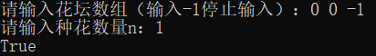
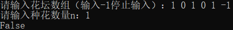
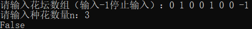
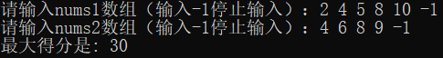
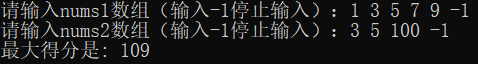
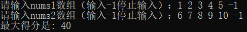

# 编程题

## Question 1

### 题目简介

假设有一个很长的花坛，一部分地块种植了花，另一部分却没有。可是，花不能种植在相邻的地块上，它们会争夺水源，最终都会死去。

给你一个整数数组 `flowerbed` 表示花坛，由若干 `0` 和 `1` 组成，其中 `0` 表示没有种植花， `1` 表示种植了花。另外有一个数 `n` , 能否在不打破种植规则的情况下种入 `n` 朵花？如果能则返回 `true` , 不能则返回 `false` 。

### 解题思路

#### 具体思路

要解决这个问题，我们需要在给定的花坛数组中找到足够的位置种下 n 朵花，同时确保不违反花朵间不能相邻的规则。解题思路如下：

1. 遍历数组：首先，我们遍历整个花坛数组 `flowerbed`。对于每一个位置 `i`，我们将检查它是否为 0（即没有种植花）。如果是，我们继续检查其相邻位置。

2. 检查相邻位置：为了在位置 `i` 种花，需要确保其左右两侧的位置（如果存在的话）也都是 0。具体来说：

    - 如果 i 是数组的第一个位置（即 i == 0），则只需要检查 flowerbed[i + 1]。

    - 如果 i 是数组的最后一个位置（即 i == size - 1），则只需检查 flowerbed[i - 1]。

    - 如果 i 在数组中间，则同时检查 flowerbed[i - 1] 和 flowerbed[i + 1]。

3. 种花和跳过检查：如果位置 `i` 可以种花（即当前位置和相邻位置都是 0），则将该位置设置为 1 表示种下了花，并将 `n` 减一（表示需要种的花朵数减少一个）。种花后，为了避免重复检查影响相邻位置的判断，我们可以跳过下一个位置，直接检查其后的位置。

4. 提前结束：每次种下一朵花后，我们检查 `n` 是否已经减到 0。如果是，说明已经成功种下所有花朵，可以立即返回 `true`。

5. 结束遍历：如果遍历完整个数组后，`n` 仍大于 0，说明没有足够的空间种下所有花朵，返回 `false`。

### 解决方案源代码

~~~cpp
class Solution {
public:
    bool canPlaceFlowers(vector<int>& flowerbed, int n) {
        int size = flowerbed.size();
        for(int i = 0;i < size && n > 0;++i)
        {
            if (flowerbed[i] == 0 && 
               (i == 0 || flowerbed[i - 1] == 0) &&
               (i == size - 1 || flowerbed[i + 1] == 0)) {
                flowerbed[i] = 1;  // 在当前位置种花
                n--;  // 减少需要种植的花的数量
                i++;
            }
        }
        return n == 0;
    }
};
~~~

### 复杂度分析

**时间复杂度：**
1. 循环遍历: `for` 循环遍历 `flowerbed` 数组，最坏情况下，即所有位置都不能种花，需要遍历整个数组。在每次成功种植花朵后，循环会跳过一个元素（`i++`），这意味着遍历次数会因成功种植而减少。然而，在最坏情况下，即使跳过部分元素，时间复杂度仍为 $O(n)$，其中 $n$ 是 `flowerbed` 的长度。

2. 条件检查: 在每次循环中，我们执行常数时间的操作来检查和设置数组元素。即使这些操作依赖于 `i` 的值（比如检查前一个和后一个元素），它们仍然是常数时间操作。

因此，整体时间复杂度为 $O(n)$。

**空间复杂度：**
1. 原地操作: 算法在原数组 `flowerbed` 上进行修改，不需要额外的数据结构来存储信息。因此，除了用于循环控制的 `i` 和用于计数的 `n` 之外，不需要额外的空间。

2. 额外变量: 使用了几个额外的变量（如 `size`），这些变量的空间消耗是常数级的。

因此，整体空间复杂度为 $O(1)$ ，表示算法使用的额外空间不随输入数据的大小而变化。

### 测试用例
输入: flowerbed = [0,0], n=1

输出: True

输入: flowerbed = [1,0,1,0,1], n=1

输出: False

输入: flowerbed = [0,1,0,0,1,0,0], n=3

输出: False

## Question 2

### 题目简介

你有两个有序且数组内元素互不相同的数组 `nums1` 和 `nums2` 。
一条**合法路径**定义如下：
- 选择数组 `nums1` 或者 `nums2` 开始遍历（从下标0出开始）。

- 从左到右遍历当前数组。

- 如果你遇到了 `nums1` 和 `nums2` 中都存在的值，那么你可以切换路径到另一个数组对应数字处继续遍历（但在合法路径中重复数字只会被统计一次）。

**得分**定义为合法路径中不同数字的和。

请你返回所有可能**合法路径**中的**最大得分**。由于答案可能很大，请你将它对 10^9 +7 取余后返回。

### 解题思路

#### 具体思路

1. 初始化：首先，我们初始化两个哈希表 `dp1` 和 `dp2`。这两个哈希表用来记录到达数组 `nums1` 和 `nums2` 中每个位置时可能得到的最大得分。此外，我们还需要两个额外的哈希表 `pos1` 和 `pos2` 来快速查找一个元素在另一个数组中的位置，这有助于在遇到公共元素时决定是否跳转。

2. 设置起始得分：初始化 `dp1` 和 `dp2` 的第一个元素，即 `dp1[nums1[0]]` = `nums1[0]` 和 `dp2[nums2[0]]` = `nums2[0]`。这表示开始遍历两个数组时的初始得分。

3. 遍历数组：接下来，我们同时遍历两个数组，比较当前元素：

 - 如果当前两个数组的元素相同，即 `nums1[i1] == nums2[i2]`，这意味着我们可以在这两个点之间进行切换。我们需要更新当前位置的得分为两个数组到达此元素位置的最大得分的较大者。

 - 然后，更新从当前位置向前进的下一步得分。不论我们决定留在当前数组还是切换到另一个数组，我们都需要保证每个元素的得分都是可能达到的最大值。

  - 如果两个数组的当前元素不相同，我们分别在各自的数组内向前推进，更新得分。

4. 处理数组剩余部分：遍历完成后，可能会有一个数组遍历完而另一个数组还有剩余元素。对于剩余的元素，我们继续沿着当前数组向前推进，更新得分，直到数组结束。

5. 获取最终最大得分：最后，最大得分将是两个数组最后一个元素得分的较大者。由于得分可能很大，按题目要求取模 10^9 + 7。

### 解决方案源代码

~~~cpp
const int MOD = 1e9 + 7;

class Solution2 {
public:
    int maxSum(vector<int>& nums1, vector<int>& nums2) {

        int dp1 = 0, dp2 = 0;

        int i = 0, j = 0;

        while (i < nums1.size() && j < nums2.size()) {
            if (nums1[i] == nums2[j]) {
                // 确保共同元素的最大得分是最大化的
                int max_prev = max(dp1, dp2) + nums1[i];
                dp1 = max(dp1, max_prev);
                dp2 = max(dp2, max_prev);
                i++;
                j++;
            }
            else if (nums1[i] < nums2[j]) {
                dp1 += nums1[i];
                i++;
            }
            else {
                dp2+=nums2[j];
                j++;
            }
        }

        // 处理剩余元素
        while (i < nums1.size()) {
            dp1+=nums1[i];
            i++;
        }
        while (j < nums2.size()) {
            dp2+=nums2[j];
            j++;
        }

        return max(dp1, dp2) % MOD;
    }
};
~~~

### 复杂度分析

**时间复杂度**

1. 算法中有三个主要循环：第一个循环比较两个数组中的元素，直到一个数组遍历完毕；接着两个循环分别处理两个数组剩下的元素。

2. 第一个循环的次数取决于两个数组的长度，因为每次迭代至少有一个数组的指针会前进。最坏情况下，两个数组中较小的长度会决定这个循环的次数。记两个数组的长度为 `n` 和 `m`，这个循环最多会执行 `min(n, m)` 次。

3. 第二和第三个循环处理剩下的元素，每个循环的次数分别取决于剩余的元素数量，最多为 `n` 或 `m` 次。

总体来看，算法的时间复杂度为 $O(n + m)$，其中 $n$ 和 $m$ 分别是两个输入数组的长度。

**空间复杂度**

1. 此算法使用了有限数量的变量 (dp1, dp2, i, j) 来存储中间计算结果和索引，不需要额外的数组或数据结构。

2. 算法不依赖于输入大小的辅助空间。

因此，算法的空间复杂度为 $O(1)$，表示它使用恒定的空间。

### 测试用例
输入: nums1 = [2,4,5,8,10] nums2 = [4,6,8,9]

输出: 30

输入: nums1 = [1,3,5,7,9] nums2 = [3,5,100]

输出: 109

输入: nums1 = [1,2,3,4,5] nums2 = [6,7,8,9,10]

输出: 40

