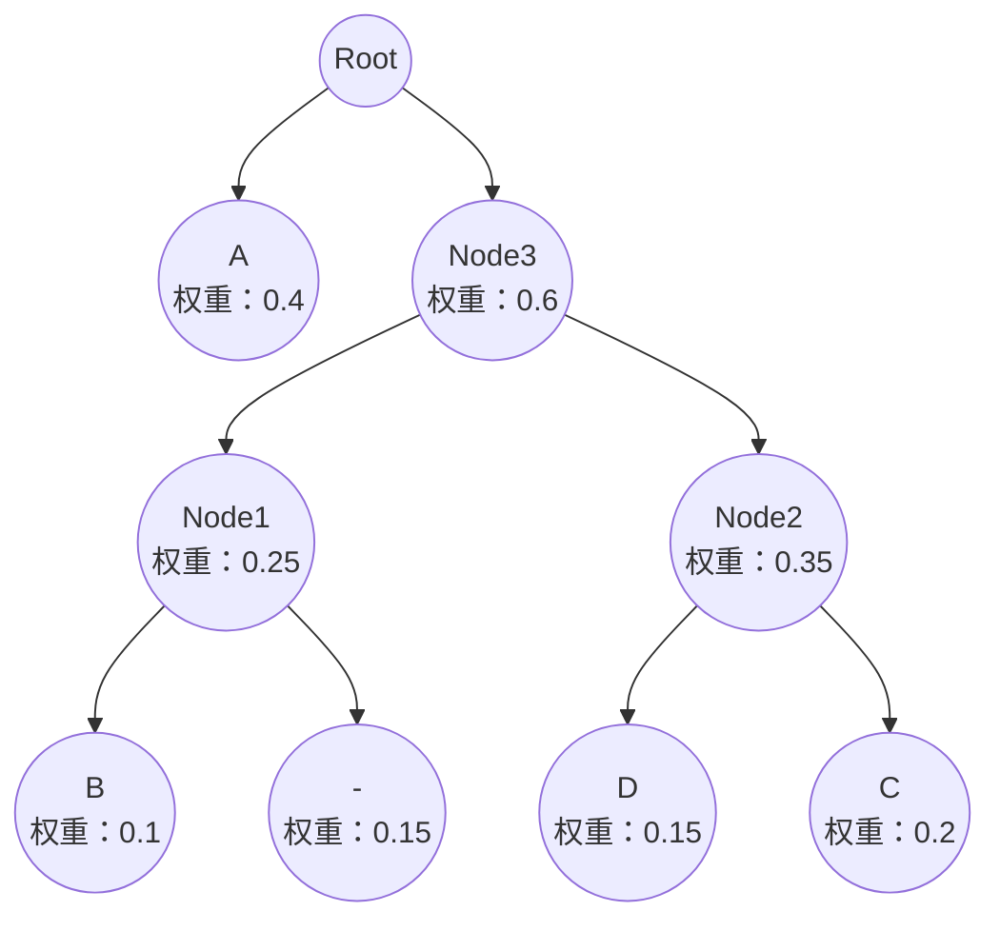

# 书面题

## Question 1

#### 算法描述
Warshall 算法是一个用于找出有向图中所有顶点对之间的可达性的算法。它能够计算出所谓的传递闭包。传递闭包是一个方阵，其中的元素 $A[i][j]$ 表示从顶点 $i$ 是否可以到达顶点 $j$ 。如果可以到达，对应位置为 1，否则为 0。Warshall 算法是通过三层嵌套循环来实现的。算法使用布尔逻辑来更新可达性信息，逐步构建传递闭包矩阵。算法的核心思想是考虑顶点 $k$ 作为从顶点 $i$ 到 $j$ 的潜在中间节点。对于每个顶点 $k$，我们都尝试更新矩阵，使得任何通过 $k$ 可以增加可达性的路径都被考虑进来。

1. 初始化：
   · 传递闭包矩阵 $R$ 最初被设置为等同于图的邻接矩阵。即如果存在从 $i$ 到 $j$ 的直接边， $R[i][j]$ 就被设置为1。
2. 更新过程：
   · 对于每个顶点 $k$ ，算法检查所有顶点对

   · 对每对顶点 $(i,j)$ ，如果 $i$ 可以通过 $k$ 到达 $j$ （即如果 $R[i][k]$ 和 $R[k][j]$ 都为真），则设置 $R[i][j]$ 为真。

#### 解题步骤

1. 初始化传递闭包矩阵为原始的邻接矩阵。
2. 对于每个节点 $k$，更新矩阵，如果 $i$ 到 $k$ 和 $k$ 到 $j$ 都有路径，则 $i$ 到 $j$ 也有路径。

#### 计算过程

初始矩阵：

$$
\begin{pmatrix}
0 & 1 & 0 & 0 \\
0 & 0 & 1 & 0 \\
0 & 0 & 0 & 1 \\
0 & 0 & 0 & 0
\end{pmatrix}
$$

1. $k = 1$ （考虑通过节点1）：
    从 1 到 2，再从 2 到 3，因此 1 到 3 有路径；
    从 1 到 2，再从 2 到 4，因此 1 到 4 有路径。
    得到：

    $$
    \begin{pmatrix}
    0 & 1 & 1 & 1 \\
    0 & 0 & 1 & 0 \\
    0 & 0 & 0 & 1 \\
    0 & 0 & 0 & 0
    \end{pmatrix}
    $$

2. $k = 2$ （考虑通过节点2）：
    从 2 到 3，再从 3 到 4，因此 2 到 4 有路径。
    得到：

    $$
    \begin{pmatrix}
    0 & 1 & 1 & 1 \\
    0 & 0 & 1 & 1 \\
    0 & 0 & 0 & 1 \\
    0 & 0 & 0 & 0
    \end{pmatrix}
    $$

3. $k = 3$ 和 $k = 4$ 不引入任何新路径。

#### 最终结果

$$
\begin{pmatrix}
0 & 1 & 1 & 1 \\
0 & 0 & 1 & 1 \\
0 & 0 & 0 & 1 \\
0 & 0 & 0 & 0
\end{pmatrix}
$$

这个矩阵表示了图中每个点到其他点的可达性。例如，第一行表示从顶点 1 可以到达顶点 2、3 和 4。

## Question 2

#### 题目概述

国际象棋中的车（Rook）从棋盘的一角移到另一对角的问题可以通过组合数学的方法来解决，因为车的移动受到严格的限制，只能沿水平或竖直方向移动。假设棋盘为一个标准的8x8国际象棋棋盘，我们需要计算从棋盘的左上角 (1,1) 移动到右下角 (8,8) 的最短路径数量。

#### 动态规划

##### 解题思路

1. **初始化**：初始化 `dp` 表，其中 `dp[1][1]` 应该设置为 1，因为从 (1,1) 到 (1,1) 只有一种方式（即不移动）。
2. **填充 `dp` 表**：接下来，按照从左到右、从上到下的顺序填充整个 `dp` 表，最终 `dp[8][8]` 将给出从 (1,1) 到 (8,8) 的路径数。

##### 代码实现

```cpp
#include <iostream>
#include <vector>

int calculateRookPaths(int n) {
    // 创建一个 n x n 的二维向量，初始化所有值为0
    std::vector<std::vector<int>> dp(n, std::vector<int>(n, 0));

    // 初始化第一行和第一列的值为1
    for (int i = 0; i < n; ++i) {
        dp[i][0] = 1;
        dp[0][i] = 1;
    }

    // 使用动态规划填充dp表
    for (int i = 1; i < n; ++i) {
        for (int j = 1; j < n; ++j) {
            dp[i][j] = dp[i-1][j] + dp[i][j-1];
        }
    }

    // dp[n-1][n-1]存储从(1,1)到(n,n)的路径数量
    return dp[n-1][n-1];
}

int main() {
    int n = 8; // 国际象棋的棋盘大小为8x8
    std::cout << "Number of shortest paths for a Rook from one corner to another on an 8x8 chessboard: " << calculateRookPaths(n) << std::endl;
    return 0;
}
```

运行结果（即答案）：3432.

#### 基本排列组合

##### 解题思路

1. **确定步数**：初始化 `dp` 表，其中 `dp[1][1]` 应该设置为 1，因为从 (1,1) 到 (1,1) 只有一种方式（即不移动）。
2. **确定路径类型**：每条路径都由7个垂直移动和7个水平移动组成，总共14步。
3. **计算路径的组合数**：我们需要从这14步中选择7步作为垂直移动，剩下的7步自然成为水平移动。这是一个典型的组合问题，可以表示为 $C(n,k)$ ，其中 $n$ 是总步数（14步），$k$ 是其中一种类型的步数（7步）。

##### 代码实现

```cpp
#include <iostream>

// 函数用于计算阶乘
long long factorial(int n) {
    long long result = 1;
    for (int i = 2; i <= n; ++i) {
        result *= i;
    }
    return result;
}

// 函数用于计算组合数 C(n, k)
long long combination(int n, int k) {
    return factorial(n) / (factorial(k) * factorial(n - k));
}

int main() {
    int n = 14;
    int k = 7;

    long long number_of_paths = combination(n, k);
    std::cout << "Number of shortest paths for a Rook from one corner to another on an 8x8 chessboard: " << number_of_paths << std::endl;

    return 0;
}
```

运行结果（即答案）：3432

## Question 3

#### 构造哈夫曼编码的基本步骤

1. 统计频率
2. 创建叶节点
3. 构造二叉树
4. 生成编码

#### question a

1. 创建优先队列（最小堆）并插入所有字符及其对应概率。
2. 重复选择两个最小的节点合并，直到生成一棵完整的哈夫曼树。
3. 从哈夫曼树根节点到每个叶节点的路径定义每个字符的编码。

##### 具体步骤

1. 初始化节点：A (0.4), B (0.1), C (0.2), D (0.15), - (0.15)
2. 步骤1：选取 B (0.1) 和 - (0.15) 合并，生成新节点 Node1 (0.25)
3. 步骤2：选取 D (0.15) 和 C (0.2) 合并，生成新节点 Node2 (0.35)
4. 步骤3：合并 Node1 (0.25) 和 Node2 (0.35)，生成 Node3 (0.6)
5. 步骤4：合并 A (0.4) 和 Node3 (0.6)，生成根节点 Root (1.0)

##### 生成树



对应哈夫曼编码：
A : 0
B : 100
C : 111
D : 110
"-" : 101

#### question b

A : 0

B : 100

A : 0

C : 111

A : 0

B : 100

A : 0

D : 110

故 ABACABAD 的编码为：0100011101000110

#### question c

100010111001010 的解码结果是 BA-DA-A